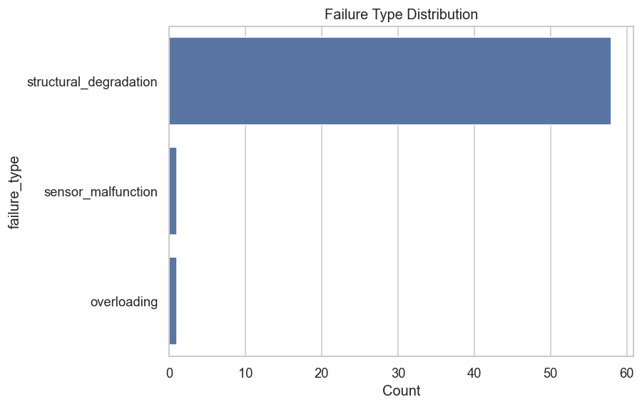
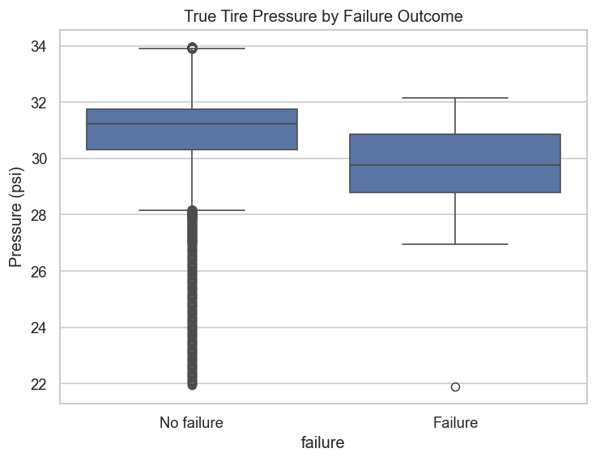
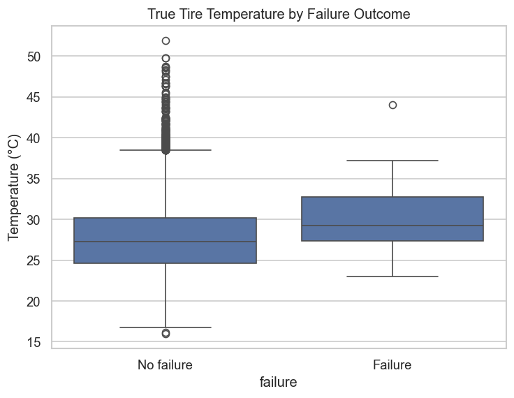
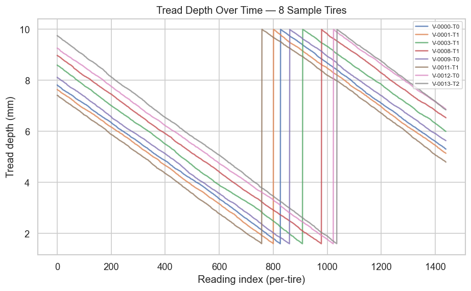
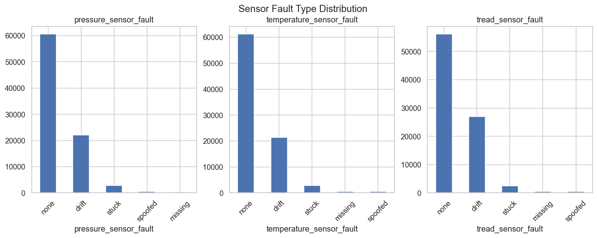
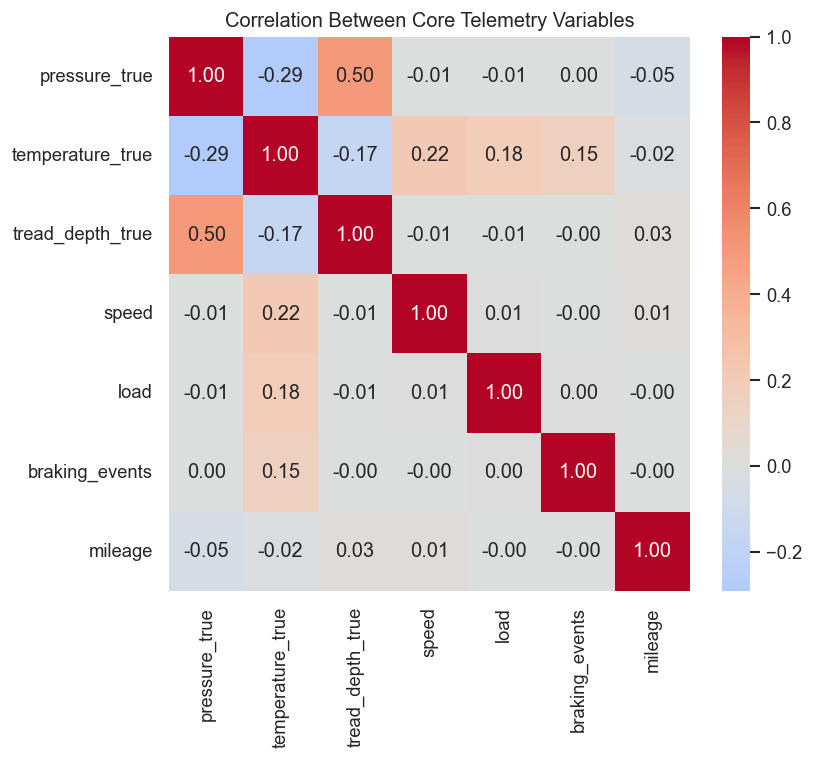

# TireGuard AI — Exploratory Data Analysis Findings

> Generated programmatically by `src/data/run_eda.py` from the actual processed dataset. Every number below was computed at run time from the data referenced — none are estimated or illustrative.

## Dataset Overview

- Rows: **86,400**
- Unique tires: **60**
- Unique vehicles: **15**
- Date range: **2026-01-01 00:00:00** to **2026-01-30 23:30:00**
- Overall failure rate: **0.0694%** of rows

## Failure Type Distribution

- `structural_degradation`: 58
- `sensor_malfunction`: 1
- `overloading`: 1

**Observation:** as flagged at the end of Milestone 1, the failure-type mix is not balanced across scripted failure modes at current simulator settings — this is visible directly in the chart above and will inform whether Milestone 3 needs class-weighting, SMOTE, or simulator re-tuning before failure-type classification (Milestone 4) is workable.

## Pressure and Temperature vs. Failure Outcome

- Mean true pressure — failed rows: **29.743** psi vs. non-failed rows: **31.027** psi
- Mean true temperature — failed rows: **30.025** °C vs. non-failed rows: **27.529** °C

## Tread Depth Trajectories (Sample Tires)

**Observation:** trajectories show gradual wear punctuated by sharp resets — the resets are the maintenance/replacement events introduced in the Milestone 1 fix (a failed tire's tread is reset rather than continuing to wear past the legal minimum indefinitely).

## Sensor Fault Distribution

- `pressure_sensor_fault`: {'none': 60544, 'drift': 22153, 'stuck': 2821, 'spoofed': 457, 'missing': 425}
- `temperature_sensor_fault`: {'none': 61180, 'drift': 21385, 'stuck': 2902, 'missing': 475, 'spoofed': 458}
- `tread_sensor_fault`: {'none': 56060, 'drift': 26998, 'stuck': 2438, 'missing': 460, 'spoofed': 444}

**Important finding:** `drift` alone accounts for **25.6%** of `pressure_sensor_fault` rows — far above the configured 3% sensor fault rate. This is expected given the simulator's design (drift persists across many consecutive steps once triggered, with only a small per-step chance of self-correcting), but it means the `sensor_fault_rate` config parameter does NOT directly correspond to "percent of rows affected" — it's closer to "percent of steps where a NEW fault episode begins." Worth fixing the parameter's naming/semantics or the persistence model before Milestone 7 relies on it.

## Missing-Value Imputation Summary

- `pressure`: 0.492% of rows were imputed (forward/backward-filled per tire)
- `temperature`: 0.55% of rows were imputed (forward/backward-filled per tire)
- `tread_depth`: 0.532% of rows were imputed (forward/backward-filled per tire)

## Correlation Between Core Variables

- Pressure–temperature correlation (true values): **-0.2909** — negative, consistent with the simulator's underinflation→heat causal rule (lower pressure is associated with higher temperature).

## Descriptive Statistics

| Variable | Mean | Std | Min | Max |
|---|---|---|---|---|
| pressure_true | 31.026 | 1.153 | 21.902 | 33.982 |
| temperature_true | 27.531 | 3.943 | 16.023 | 51.96 |
| tread_depth_true | 6.175 | 2.273 | 1.586 | 9.998 |
| speed | 70.077 | 19.998 | 0.0 | 151.71 |
| load | 500.143 | 81.122 | 172.84 | 1270.82 |

## Known Limitations Carried Into Milestone 3

- Failure-type imbalance (see above) may require class-weighting or simulator re-tuning before Milestone 4 (failure-type classification) is meaningful.
- `sensor_malfunction` failures still have no distinct telemetry signature (carried over from Milestone 1) — worth deciding whether to fix in the simulator or simply exclude this failure type from Milestone 4's target classes.
- The `sensor_fault_rate` config parameter's effective meaning (see drift finding above) should be documented or fixed before Milestone 7/8 tune detection thresholds against it.